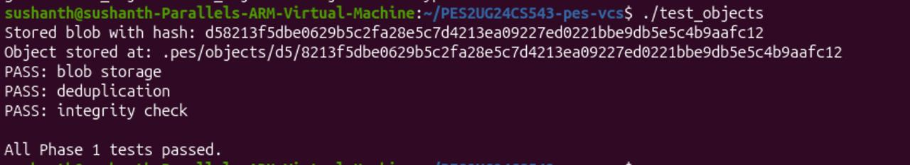
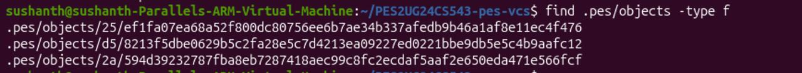
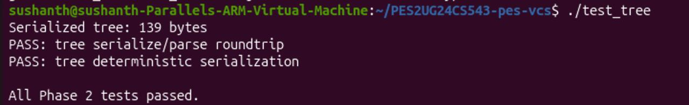
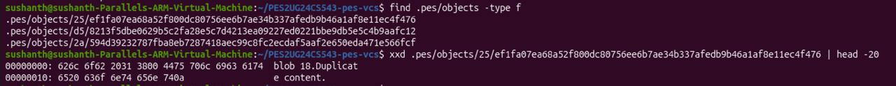
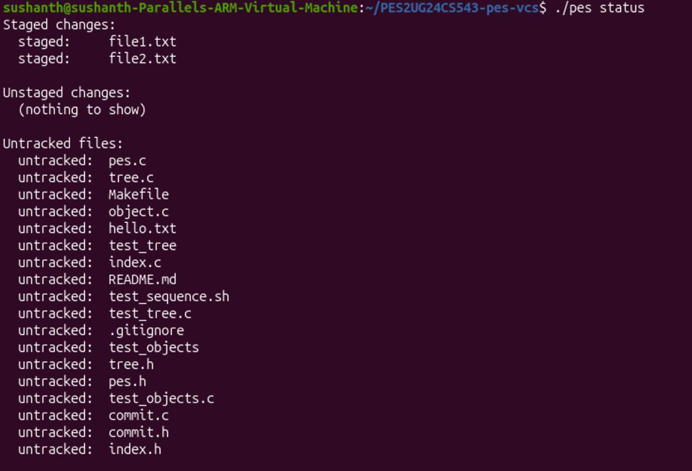
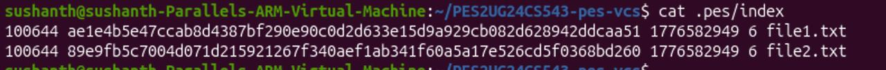
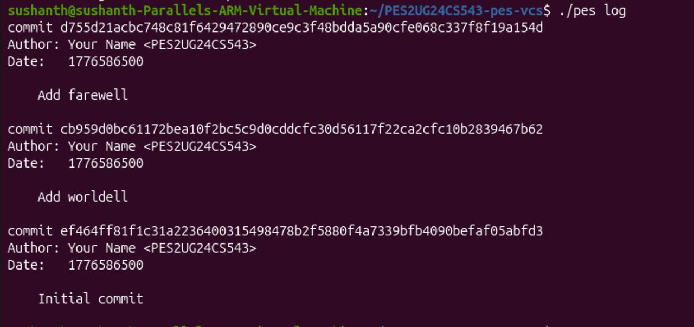
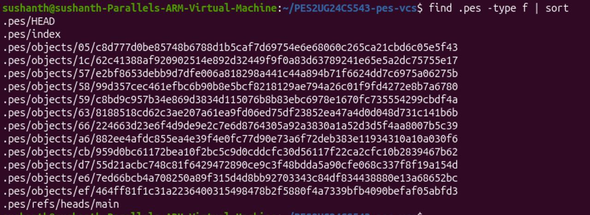
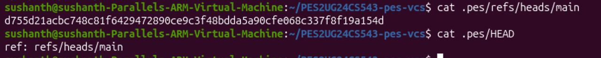

# PES Version Control System - Lab Report

**Name:** Sushanth B  
**SRN:** PES2UG24CS543  
**Repository:** PES2UG24CS543-pes-vcs  
**Platform:** Linux (ARM Virtual Machine)  

---

## Table of Contents
1. [Phase 1: Object Storage](#phase-1-object-storage)
2. [Phase 2: Tree Objects](#phase-2-tree-objects)
3. [Phase 3: The Index (Staging Area)](#phase-3-the-index-staging-area)
4. [Phase 4: Commits and History](#phase-4-commits-and-history)
5. [Final Integration Test](#final-integration-test)
6. [Phase 5: Branching and Checkout](#phase-5-branching-and-checkout-analysis)
7. [Phase 6: Garbage Collection](#phase-6-garbage-collection-analysis)

---

## Phase 1: Object Storage

**Core Concepts:** Content-addressable file storage, directory sharding, SHA-256 hashing, and atomic write operations.

**Implementation Details:**
I implemented the `object_write` and `object_read` functions inside `object.c`. 
- The `object_write` function constructs a type header (e.g., `"blob <size>\0"`), calculates the SHA-256 checksum, and stores the file inside `.pes/objects/XX/`. To prevent data corruption, it utilizes a temporary file combined with `fsync` and an atomic rename.
- The `object_read` function retrieves the file, verifies data integrity against the filename hash, and parses the payload.
- To prevent redundant storage, the system checks `object_exists` before writing.

*Caption: ./test_objects execution. All Phase 1 tests pass successfully.*

*Caption: Sharded object directory structure mirroring Git.*

---

## Phase 2: Tree Objects

**Core Concepts:** Directory representation as linked nodes, recursive tree generation.

**Implementation Details:**
I developed `tree_from_index` in `tree.c`. It reads the staging area, sorts the file paths, and uses a recursive helper (`write_tree_level`) to structure entries into nested subtree objects.

*Caption: Output of ./test_tree. Serialization and deterministic tests pass.*

*Caption: Raw binary inspection of an object file using xxd.*

---

## Phase 3: The Index (Staging Area)

**Core Concepts:** Plain-text staging records, atomic updates, and metadata-based change detection.

**Implementation Details:**
I completed `index_load`, `index_save`, and `index_add` in `index.c`.
- `index_save` sorts index entries, writes to a temp file, flushes via `fsync`, and renames atomically.
- `index_add` stores file blobs and uses `lstat` for metadata tracking (mode, size, mtime).

*Caption: ./pes status showing staged files.*

*Caption: Human-readable contents of .pes/index.*

---

## Phase 4: Commits and History

**Core Concepts:** Linked commit structures, symbolic HEAD, and atomic references.

**Implementation Details:**
I implemented `commit_create` in `commit.c`. This captures the index as a tree, generates a timestamp, and uses `head_update` to atomically overwrite the active branch reference.

*Caption: ./pes log displaying commit history.*

*Caption: Repository object growth shown via find.*

*Caption: Validation of HEAD and refs/heads/main.*

---

## Final Integration Test

The full end-to-end integration test (`test_sequence.sh`) completes successfully, verifying:
1. Repository initialization.
2. Staging files and status checking.
3. Sequential commits and history traversal.

---

## Phase 5: Branching and Checkout (Analysis)

**Q5.1: Implementation:** I would read the target branch's hash, fetch the tree, validate the working directory for dirty files, write the new blob contents, and update `HEAD`.

**Q5.2: Conflicts:** Checked via `lstat` (mtime/size) compared against index values. If mismatched, checkout is blocked to prevent data loss.

**Q5.3: Detached HEAD:** Occurs when pointing directly to a commit hash rather than a branch ref. New commits become orphaned if a branch is not created.

---

## Phase 6: Garbage Collection (Analysis)

**Q6.1: Algorithm:** A mark-and-sweep process. **Mark** reachable objects from branch refs. **Sweep** unreferenced files from `.pes/objects/`.

**Q6.2: Race Conditions:** A write (blob) could be deleted by GC before the commit object referencing it is written. Mitigated by grace periods (e.g., 2 weeks) and lock files (`gc.pid`).
